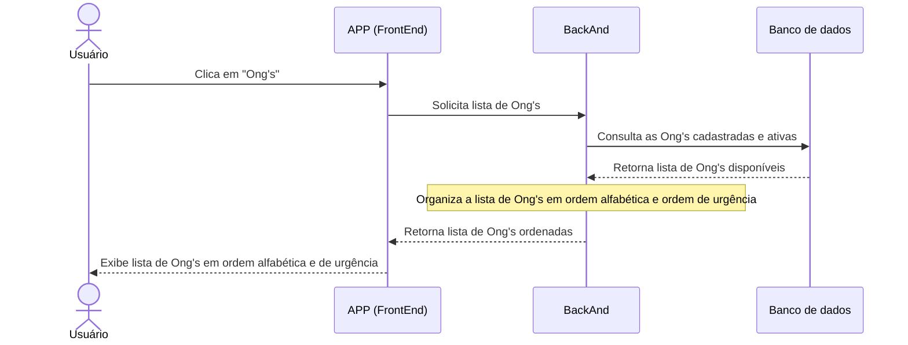

# projeto-integrador--semestre-1
Gerenciador de ONG's
Um aplicativo mobile e um site para desktop voltado para organização, divulgação e doação para ongs de diversas causas.


### UML geral do gerenciador de ongs. 

### Criação de conta
```mermaid
actor U as Usuário
participant A as APP(Frontend)
participant B as Backend
participant C as Banco de dados 

U->>A: Clica em "Primeiro acesso"
A->>B: Prepara o ambiente de criação de conta
B->>D: Armazena os dados da conta no banco de dados
D-->>B: Verificação de conta
B-->>A: Retorna o acesso a conta
A-->>B:Retorna a página inicial  


